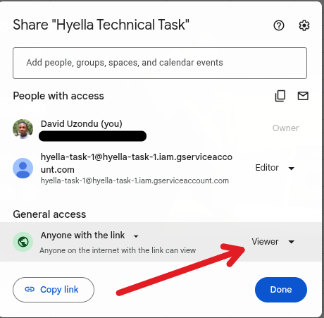

# Hyella Task 1

This project demonstrates how to consume the Google Sheets API using **pure PHP (no SDKs, no Composer)** and populate a Google Sheet with randomly generated user data.

It uses:

* Google OAuth 2.0 (Service Account)
* Google Sheets REST API
* randomuser.me API
* PHP cURL + OpenSSL

## What This Project Does

* Generates random users from [https://randomuser.me](https://randomuser.me)
* Authenticates to Google using a Service Account
* Appends rows into a Google Sheet like [this one](https://docs.google.com/spreadsheets/d/1owwQvwgFjjkbvei1t70jsgvZebMvpYJvr7SMiRiGBzI/edit?gid=0#gid=0)
* Runs entirely from the command line

Each run inserts multiple users into the spreadsheet.

## Important Setup Note

This project **expects Google credentials to live in an external file called `service-account.json`**.

The `index.php` file reads and uses this JSON file at runtime.
If the file is missing or invalid, authentication will fail.

> [!NOTE]
> You must provide your own valid `service-account.json` file.
> The example spreadsheet linked above will only work if it has been shared with your service account.

> [!IMPORTANT]
> The `service-account.json` file must not be committed to GitHub.
> It contains private keys and should always be kept out of version control.
> You should add it to your `.gitignore` file immediately after creating it.

## Important Concept: Service Accounts

This project does **not use your personal Google account**.

Instead, it uses a **Service Account** created inside Google Cloud.
That service account acts like a robot user that can access Google APIs.

The private key and private key id come from that service account and are stored inside `service-account.json`.

### Steps to Get a Service Account Key

1. Go to [https://console.cloud.google.com](https://console.cloud.google.com)
2. Create a new project or select an existing one
3. Enable **Google Sheets API**
4. Go to **IAM & Admin → Service Accounts**
5. Click **Create Service Account**
6. Give it any name
7. Open the service account and go to the **Keys** tab
8. Click **Add Key → Create New Key**
9. Choose **JSON** and download

That downloaded file should be placed in the same directory as `index.php` and renamed to `service-account.json`.

## Q & A

### 1. Why can't I edit the document directly?

If you are accessing the spreadsheet as a guest, it is likely because the share settings for guests are set to view-only.



Google treats guest users differently from signed-in Google accounts. Even if the sheet appears editable to the owner, guests may only have read access.

#### Will the code work if the document is editable?

Yes.

The spreadsheet must be shared with the **service account email** and given **Editor** permission.

### 2. Whose private key and private key id are being used?

They belong to the **Google Cloud Service Account you created**.

They identify your backend application to Google and are not tied to a Gmail user.

### 3. Will it still work if the spreadsheet is private?

Yes.

As long as:

* The spreadsheet is shared with the service account email
* The service account has **Editor** permission

Public visibility is not required.

### 4. What are the limitations?

When using the Google Sheets API like in this project, there are limits you should be aware of. These limits are about request volume, not spreadsheet visibility.

#### API quotas

* Sheets API has per minute quotas on read and write requests

  * Around **300 reads per minute per project**
  * Around **300 writes per minute per project**
  * Around **60 requests per user per minute per project**

* Exceeding these limits results in `429 Too Many Requests` errors until the quota resets

* There is **no hard daily cap** on read or write operations as long as you stay within per minute limits

* Google recommends implementing retries with exponential backoff for quota errors

* Writing many rows one at a time consumes quota faster than batching rows into a single request

* Very large or slow requests can time out after roughly 180 seconds

This API works great for small to moderate automation but is not designed for extremely high traffic workloads.

## Project Structure

```
project-folder/
├ index.php
└ service-account.json
```

The `service-account.json` file should never be committed to version control.

## Configuration

Inside `index.php`:

```php
define("SHEET_ID", "YOUR_SHEET_ID");
define("SHEET_RANGE", "Sheet1");
```

Get the Sheet ID from:

```
https://docs.google.com/spreadsheets/d/THIS_PART/edit
```

## Running the Script

```bash
php index.php
```

Expected output:

```
Generating data (1)...Appending data...Inserted: Sheet1!A17:I17
```

## Security Notes

* Never commit real credentials
* Add `service-account.json` to `.gitignore`
* Rotate keys if they are ever exposed
* Use environment variables or a secret manager in production

## Summary

* Uses Service Account authentication
* Spreadsheet can be public or private
* Service account must have Editor access
* Credentials are loaded from an external `service-account.json` file

