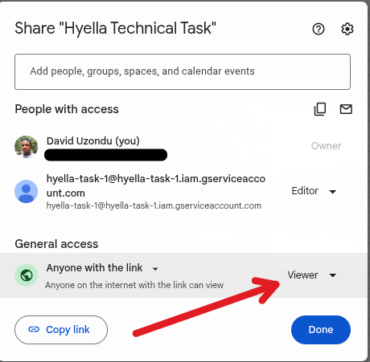

# Hyella Task 1

This project demonstrates how to consume the Google Sheets API using **pure PHP (no SDKs, no Composer)** and populate a Google Sheet with randomly generated user data.

It uses:

- Google OAuth 2.0 (Service Account)
- Google Sheets REST API
- randomuser.me API
- PHP cURL + OpenSSL

## What This Project Does

- Generates random users from https://randomuser.me  
- Authenticates to Google using a Service Account  
- Appends rows into a publicly accessible Google Sheet like [this one](https://docs.google.com/spreadsheets/d/1owwQvwgFjjkbvei1t70jsgvZebMvpYJvr7SMiRiGBzI/edit?gid=0#gid=0).
- Runs entirely from the command line  

Each run inserts multiple users into the spreadsheet.

## Important Demo Note

Normally, Google credentials are stored inside a separate file called
`service-account.json`.

However, **for demo purposes**, the credentials have been placed **directly inside `index.php`** so that the entire solution lives in a single file.

This makes testing easier, but **this is NOT recommended for production**.

In a real project:

- Store credentials in `service-account.json`
- Add the file to `.gitignore`
- Never commit secrets to GitHub

## Important Concept: Service Accounts

This project does **not use your personal Google account**.

Instead, it uses a **Service Account** created inside Google Cloud.  
That service account acts like a robot user.

The private key and private key id belong to that service account.

### Steps to Get a Service Account Key

1. Go to https://console.cloud.google.com  
2. Create a new project (or select existing)  
3. Enable **Google Sheets API**  
4. Go to **IAM & Admin → Service Accounts**  
5. Click **Create Service Account**  
6. Give it any name  
7. Open the service account → **Keys** tab  
8. Click **Add Key → Create New Key**  
9. Choose **JSON** and download  

These values are what appear inside `service-account.json` (or directly in `index.php` for this demo).

## Q & A

### 1. Why can't I edit the document directly?

If you are accessing the spreadsheet as a guest, it is likely because the share settings for guests are set to view-only.



Google treats guest users differently from signed-in Google accounts. Even if the sheet appears editable to the owner, guests may only have read access.

### Will the code work if the document is editable?

Yes.

The spreadsheet must be shared with the service account and given **Editor** permission.

### 2. Whose private key and private key id are being used?

They belong to the **Google Cloud Service Account you created**.

They identify your backend application to Google.

They are not tied to a Gmail user.

### 3. Will it still work if the spreadsheet is private?

Yes.

As long as:

- The spreadsheet is shared with the service account email  
- The service account has **Editor** permission  

Public visibility is not required.

## Project Structure (Recommended)

```
project-folder/
├ index.php
└ service-account.json
````

For this demo, credentials may exist directly inside `index.php`.

## Configuration

Inside `index.php`:

```php
define("SHEET_ID", "YOUR_SHEET_ID");
define("SHEET_RANGE", "Sheet1");
````

Get the Sheet ID from:

```
https://docs.google.com/spreadsheets/d/THIS_PART/edit
```

## Running the Script

```bash
php index.php
```

Expected output:

```
Generating data (1)...Appending data...Inserted: Sheet1!A17:I17
```


## Security Notes

* Never commit real credentials
* Rotate keys if leaked
* Use environment variables or secret managers in production


## Summary

* Uses Service Account authentication
* Spreadsheet can be public or private
* Service account must be Editor
* Credentials are embedded only for demo convenience

